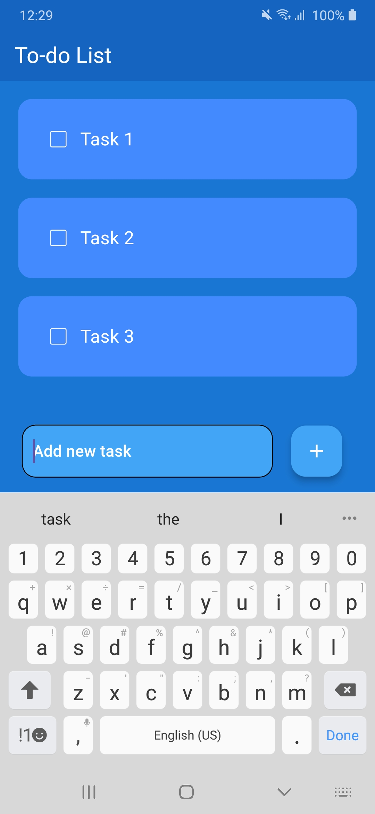
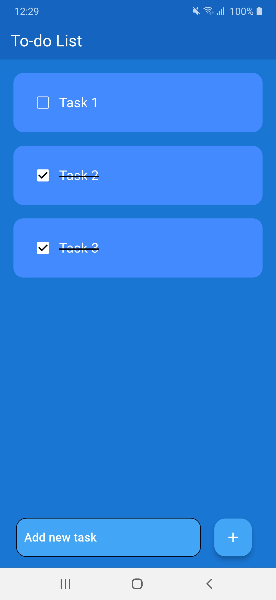

# To-Do List App

This is a simple and intuitive To-Do List app built using Flutter as part of the **CodeClause Android Development Internship**. The app allows users to manage their tasks efficiently by adding, updating, and deleting tasks.

## Features

- **Add Tasks**: Users can add new tasks with a title and description.
- **Mark as Complete**: Tasks can be marked as completed for better task management.
- **User-Friendly Interface**: A clean and minimal design with smooth navigation.

## Technologies Used

- **Flutter**: Dart-based framework for building cross-platform applications.
- **Dart**: Programming language used for Flutter development.
- **State Management**: Managed using setState or a state management tool like Provider (if used).

## Installation

1. Clone this repository:
   ```bash
   git clone https://github.com/iPriyanshu19/CodeClauseInternship_To-Do-App.git

   ```
2. Navigate to the project directory:
   ```bash
   cd todo_list_project
   ```
3. Install dependencies:
   ```bash
   flutter pub get
   ```
4. Run the app on an emulator or a physical device:
   ```bash
   flutter run
   ```

## Screenshots

Here’s a preview of the app:

### Home Screen


### Add Task



### Modify Task



## Future Enhancements

- **Task Reminders**: Integrate a notification feature to remind users of pending tasks.
- **Dark Mode**: Add a toggle option for dark mode.
- **Task Categories**: Allow users to categorize tasks for better organization.
